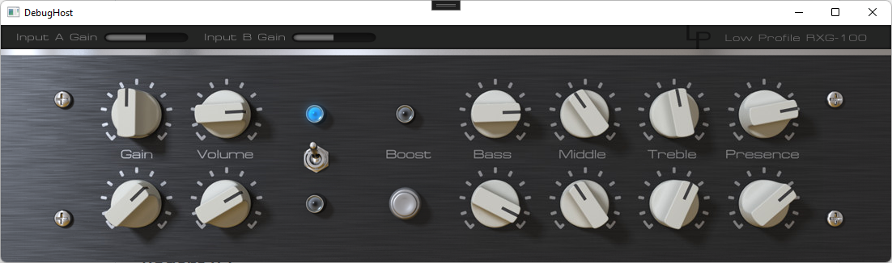

# RXG100-RE

An emulation of the Randall RG100 preamp.

*This is a remade version of [RXG100](https://github.com/ValdemarOrn/SharpSoundPlugins) VST originally designed by Valdemar Erlingsson.*

| Spec  | Original RXG100 | RXG100-RE |
| --- | ---|---|
| VST Version | VST 2 | VST 3 |
| Graphics | WinForm | WPF |
| Runtime | .NET Framework 4.0 | .NET Core 6.0 |
| Bridging | [SharpSoundDevice](https://github.com/ValdemarOrn/SharpSoundDevice) | [AudioPlugSharp](https://github.com/xuan25/AudioPlugSharp) |

## Build

You will need to have [CMake](https://cmake.org) and [Visual Studio 2022](https://visualstudio.microsoft.com/) installed.

1. Run script [setup_sdk.bat](setup_sdk.bat) to set up the vst3sdk. It will create a new folder [AudioPlugSharp/vstbuild](AudioPlugSharp/vstbuild).
2. Load and Build the solution [RXG100RE.sln](RXG100RE.sln) with Visual Studio.
3. You will find the output VST plugin within foldeFr [RXG100RE/bin/Release/net6.0-windows](RXG100RE/bin/Release/net6.0-windows).

## Install

1. Copy the following 6 files to your VST3 folder `%CommonProgramFiles%/VST3` or put them into a subfolder `%CommonProgramFiles%/VST3/RXG100-RE`
   1. `AudioPlugSharp.dll`
   2. `AudioPlugSharpWPF.dll`
   3. `Ijwhost.dll`
   4. `RXG100RE.dll`
   5. `RXG100REBridge.runtimeconfig.json`
   6. `RXG100REBridge.vst3`
2. Run a plugin re-scan in your VST host.
